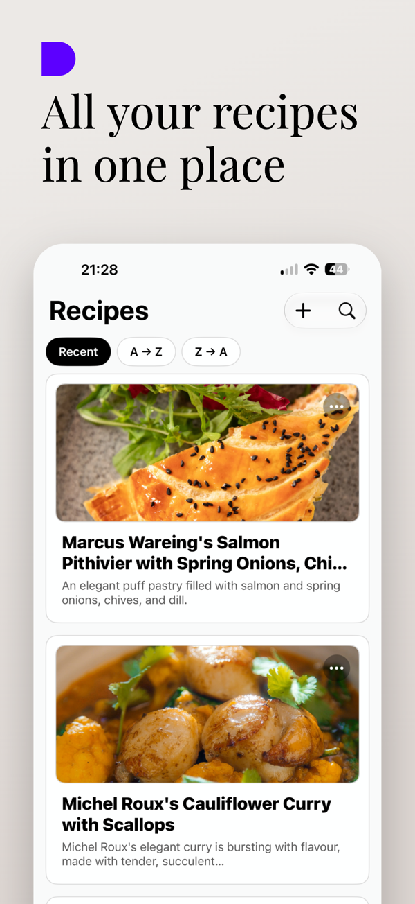
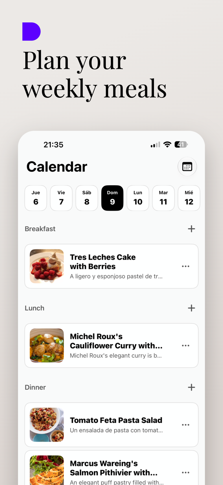
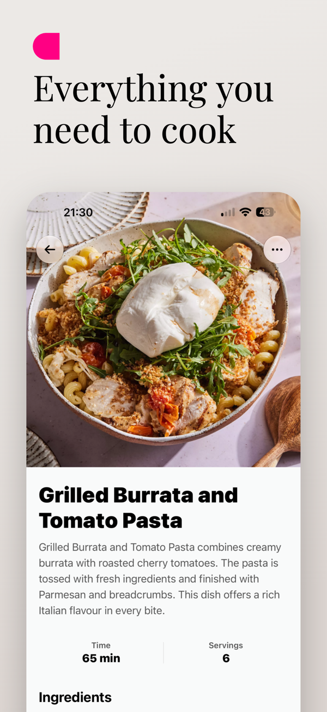
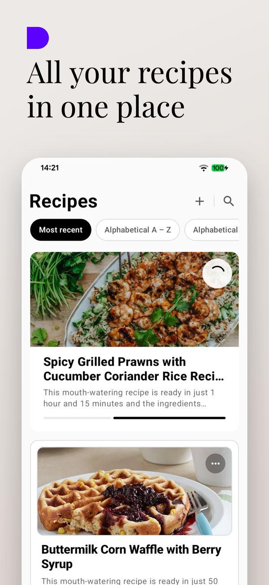
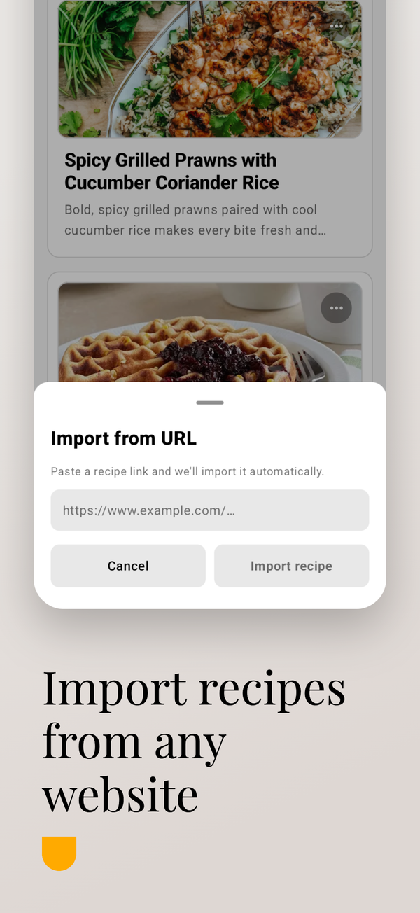
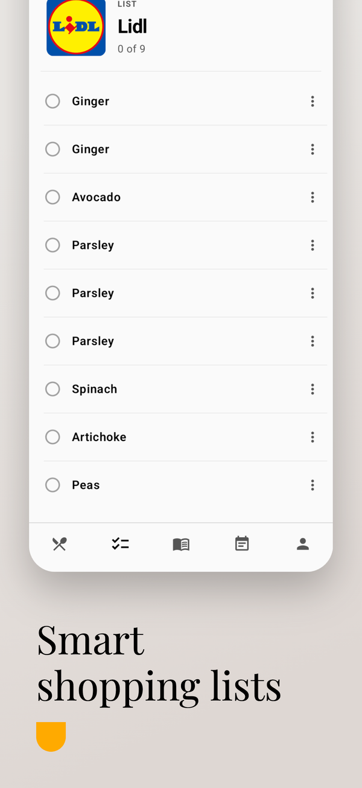
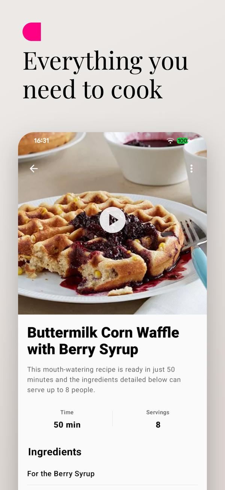

# BlueList — recipes and shopping list

> Recipe and shopping list app for Android, iOS and smartwatches, with recipe import
> handled by **AI that runs on the device itself**. Published on
> **[Google Play](https://play.google.com/store/apps/details?id=app.bluelist)** and the
> **[App Store](https://apps.apple.com/es/app/id6780220062)**.
>
> This repository is a **product showcase**: the source code is private because the app
> is commercial (subscription). Here I explain what it does and how it is built.

<b>iOS</b>

  
  
  
  
  

<b>Android</b>

  
  
  
  
  

## What it does

Your recipe collection and your shopping list in the same app.

- **Recipes** with photo, time, servings, ingredients and steps; they can be split into
  several (dough, filling, sauce) and searched by name or ingredient.
- **On-device AI import**: you paste the link of a recipe website or a YouTube video and
  the app fills in title, photo, ingredients and steps. The AI runs inside the phone —
  **Gemini Nano** on Android and **Apple Intelligence** on iOS — so there is no API cost
  per user and the text never leaves the device.
- **Shopping list** one tap away from the recipe, a catalog of 340 products in 14
  categories, logos for more than 300 supermarkets.
- **Cookbooks** and a **weekly meal plan** on a calendar.
- **Loyalty cards** scanned, shown full screen and at maximum brightness.
- Watch apps (**Wear OS** and **watchOS**): lists and cards from your wrist.
- **Premium** (subscription): cloud sync across devices and sharing recipes, books and
  lists by link, with the lists updating **in real time**.

19 languages, no ads, and the account can be deleted with all its data from the app.

## How it is built

| Layer | Technology |
|---|---|
| Android | Kotlin, **Jetpack Compose**, Room; on-device AI with **Gemini Nano** through ML Kit GenAI |
| iOS | **Native, standalone SwiftUI** (shares no code with Android); on-device AI with **Apple Foundation Models** |
| Watches | Wear OS and watchOS as companion apps |
| Backend | Firebase: Auth, Firestore, Storage, **Cloud Functions** (verification of Google and Apple purchases, scheduled cleanup, account deletion), App Check, Hosting |
| Web | Landing page and shared-link pages (`/join`, `/recipe`, `/cookbook`) on Firebase Hosting |

### Technical decisions I am proud of

- **AI on the device, not in the cloud.** I started with a cloud model and turned it off:
  with Gemini Nano and Apple Intelligence the import is free per user, works offline and
  sends no data anywhere. The trade-off is that phones without support still have to be
  handled properly: on those, the recipe is added by hand and everything else works the same.
- **Two native apps with parity.** Android and iOS share no UI or domain code, but they
  do share the data format: there are tests that check that both parse the recipe JSON
  exactly the same way.
- **Tested security rules.** The Firestore and Storage rules have a suite of 350 cases
  that runs before deploying, so that sharing a list never opens up more than it should.
- **Purchases verified on the server.** Google and Apple are validated in Cloud
  Functions, not on the client, and Premium is only turned on when the server confirms it.

## Publishing

Two stores, subscriptions in both, store listings in several languages, a privacy policy
and the maintenance that comes after: new versions, real bugs and real users.

---

Pedro Antonio Flores Casquet · [github.com/PedroFlores199](https://github.com/PedroFlores199)
