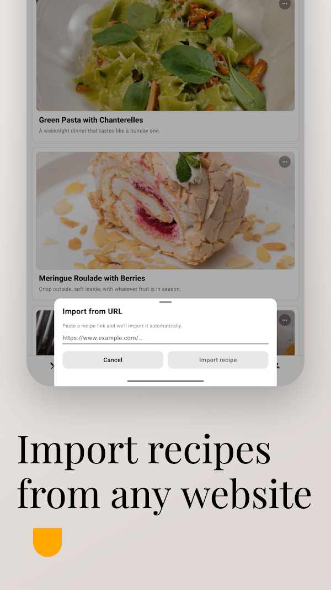
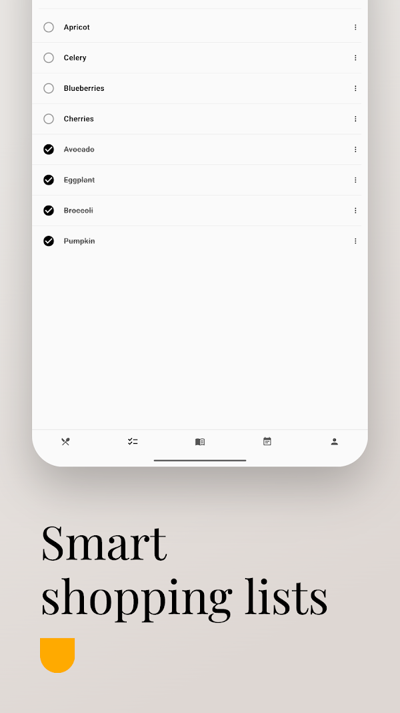
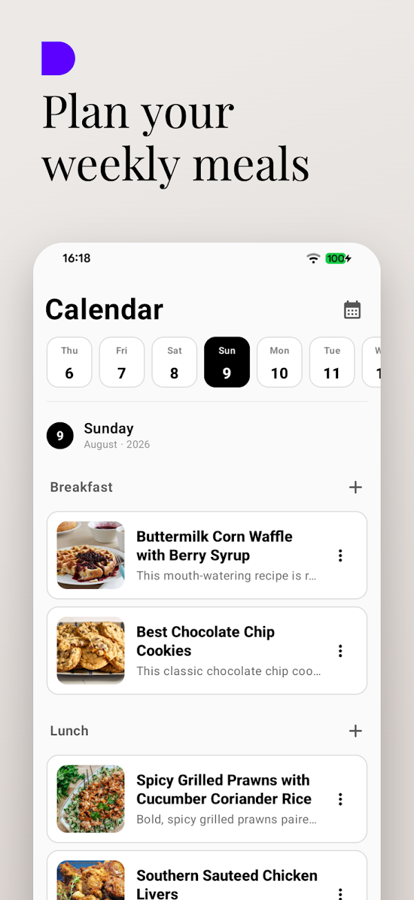
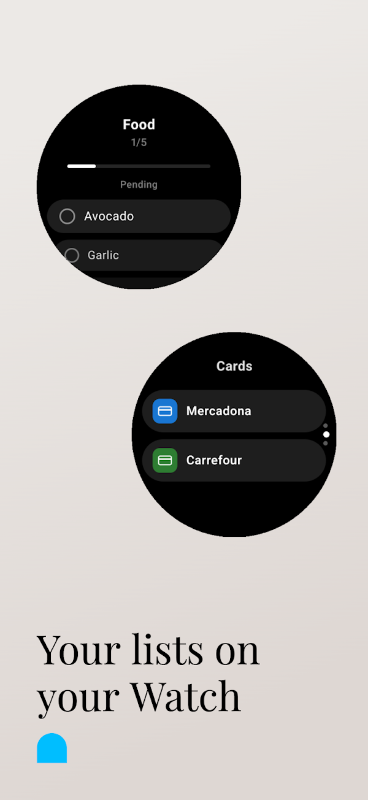

# BlueList — recetas y lista de la compra

> App de recetas y listas de la compra para Android, iOS y relojes, con importación de
> recetas mediante **IA que se ejecuta en el propio dispositivo**. Publicada en
> **[Google Play](https://play.google.com/store/apps/details?id=app.bluelist)** y
> **[App Store](https://apps.apple.com/es/app/id6780220062)**.
>
> Este repositorio es una **presentación del producto**: el código fuente es privado
> porque la app es comercial (suscripción). Aquí explico qué hace y cómo está construida.

  
  
  
  
  

## Qué hace

Tu recetario y tu lista de la compra en la misma app.

- **Recetas** con foto, tiempo, raciones, ingredientes y pasos; se pueden partir en
  varias (masa, relleno, salsa) y buscar por nombre o ingrediente.
- **Importación con IA local**: pegas el enlace de una web de recetas o de un vídeo de
  YouTube y la app rellena título, foto, ingredientes y pasos. La IA corre dentro del
  móvil — **Gemini Nano** en Android y **Apple Intelligence** en iOS — así que no hay
  coste de API por usuario y el texto nunca sale del dispositivo.
- **Lista de la compra** de un toque desde la receta, catálogo de 340 productos en 14
  categorías, logos de más de 300 supermercados.
- **Libros de cocina** y **menú semanal** en calendario.
- **Tarjetas de fidelización** escaneadas, a pantalla completa y con brillo al máximo.
- Apps de reloj (**Wear OS** y **watchOS**): listas y tarjetas desde la muñeca.
- **Premium** (suscripción): sincronización en la nube entre dispositivos y compartir
  recetas, libros y listas por enlace, con las listas actualizándose **en tiempo real**.

19 idiomas, sin anuncios, y la cuenta se puede borrar con todos sus datos desde la app.

## Cómo está construida

| Capa | Tecnología |
|---|---|
| Android | Kotlin, **Jetpack Compose**, Room; IA local con **Gemini Nano** vía ML Kit GenAI |
| iOS | **SwiftUI nativo e independiente** (no comparte código con Android); IA local con **Apple Foundation Models** |
| Relojes | Wear OS y watchOS como apps compañeras |
| Backend | Firebase: Auth, Firestore, Storage, **Cloud Functions** (verificación de compras de Google y Apple, limpieza programada, borrado de cuenta), App Check, Hosting |
| Web | Landing y páginas de enlaces compartidos (`/join`, `/recipe`, `/cookbook`) en Firebase Hosting |

### Decisiones técnicas de las que estoy orgulloso

- **IA en el dispositivo, no en la nube.** Empecé con un modelo en la nube y lo apagué:
  con Gemini Nano y Apple Intelligence la importación es gratis por usuario, funciona sin
  conexión y no envía datos a ningún sitio. A cambio, hay que tratar bien los móviles que
  no la soportan: ahí la receta se añade a mano y todo lo demás funciona igual.
- **Dos apps nativas con paridad.** Android e iOS no comparten código de UI ni de
  dominio, pero sí el formato de datos: hay tests que verifican que ambas parsean
  exactamente igual el JSON de las recetas.
- **Reglas de seguridad probadas.** Las reglas de Firestore y Storage tienen una suite de
  350 casos que se ejecuta antes de desplegar, para que compartir una lista nunca abra
  más de lo que debe.
- **Compras verificadas en servidor.** Google y Apple se validan en Cloud Functions, no
  en el cliente, y Premium solo se activa cuando el servidor lo confirma.

## Publicación

Dos tiendas, suscripciones en las dos, fichas en varios idiomas, política de privacidad y
el mantenimiento posterior: versiones nuevas, fallos reales y usuarios reales.

---

Pedro Antonio Flores Casquet · [github.com/PedroFlores199](https://github.com/PedroFlores199)
